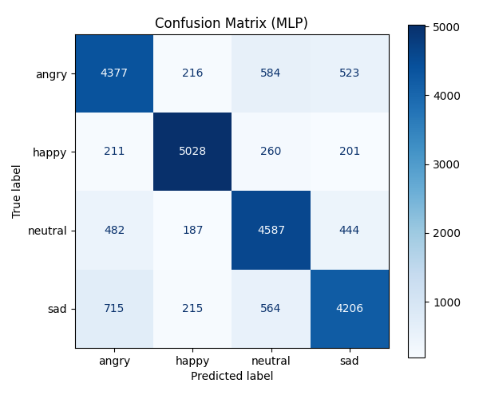

# Face Emotion Recognition Model (MLDL)

얼굴 이미지를 기반으로 감정을 인식하는 시스템입니다.  
DeepFace 라이브러리를 사용해 얼굴 임베딩을 추출하고 scikit-learn의 MLPClassifier를 활용하여 감정을 예측합니다.  
웹캠 영상을 실시간으로 처리하여 분석 결과를 화면에 오버레이하는 기능을 제공합니다.

---

## 프로젝트 개요

- **목표:**  
  얼굴 이미지를 입력받아 DeepFace를 통해 임베딩을 추출한 후, MLPClassifier 모델을 이용하여 감정을 예측합니다.

- **주요 기능:**  
  - DeepFace를 이용한 얼굴 임베딩 추출  
  - 학습된 MLPClassifier 모델로 감정 예측  
  - 웹캠 영상을 통한 실시간 감정 인식  
  - 한글 감정 라벨(예: "짜증", "행복", "무표정", "슬픔") 표시 및 안정화 처리

---

## 파일 및 디렉토리 구조
```bash
face_emotion_model-MLDL-/
├── MLPClassifier/
│   └── results/
│       └── mlp_model.pkl
├── images/
├── train_src/
├── view/
│   └── webcam_view.py
├── .gitignore
├── main.py
└── README.md
```

---

## 사용 기술
| **카테고리**           | **기술 스택**                                                                                                                                                                                                                                                                                         |
|------------------------|--------------------------------------------------------------------------------------------------------------------------------------------------------------------------------------------------------------------------------------------------------------------------------------------------------|
| **OS & Editor**        | [](https://ubuntu.com/) [](https://code.visualstudio.com/)  |
| **Language & Library** | [](https://www.python.org/) [](https://opencv.org/) [](https://numpy.org/) [](https://scikit-learn.org/) <br> [](https://github.com/serengil/deepface) [](https://python-pillow.org/) [](https://joblib.readthedocs.io/) |
| **Version Control**    | [](https://git-scm.com/) [](https://github.com/)                                                                                       |
                                      |

---

## 성능 결과

- **모델 구조**: DeepFace(ArcFace) 임베딩 + MLPClassifier (2 hidden layers: 128 → 64)
- **입력 데이터**: 표정 이미지 → DeepFace 임베딩 (벡터화)
- **클래스 구성**: angry, happy, neutral, sad (총 4개)
- **데이터 분할**: 학습 80% / 테스트 20% (Stratified 방식)

- **평가 지표**:
  - 전반적인 **Accuracy**: 약 **89~92% 수준**
  - 클래스별 Precision / Recall / F1-score:

    

  - Confusion Matrix:

    

  - 대용량 이미지 배치 처리 + 중간 저장 기능 탑재 (`.npy` 저장으로 중단 복구 가능)
  - 학습 모델 및 결과:
    - `./results/mlp_model.pkl`: 학습 완료된 모델 파일
      
---
