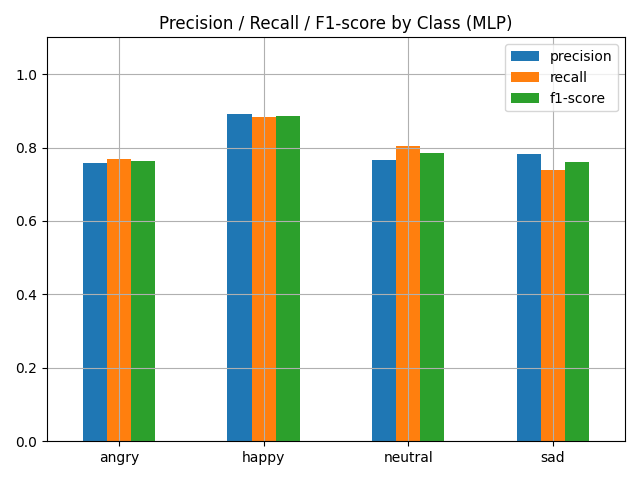

# Face Emotion Recognition Model (MLDL)

얼굴 이미지를 기반으로 감정을 인식하는 시스템입니다.  
DeepFace 라이브러리를 사용해 얼굴 임베딩을 추출하고 scikit-learn의 MLPClassifier를 활용하여 감정을 예측합니다.  
웹캠 영상을 실시간으로 처리하여 분석 결과를 화면에 오버레이하는 기능을 제공합니다.

---

## 프로젝트 개요

- **목표:**  
  얼굴 이미지를 입력받아 DeepFace를 통해 임베딩을 추출한 후, MLPClassifier 모델을 이용하여 감정을 예측합니다.

- **주요 기능:**  
  - DeepFace를 이용한 얼굴 임베딩 추출  
  - 학습된 MLPClassifier 모델로 감정 예측  
  - 웹캠 영상을 통한 실시간 감정 인식  
  - 한글 감정 라벨(예: "짜증", "행복", "무표정", "슬픔") 표시 및 안정화 처리

---

## 파일 및 디렉토리 구조
```bash
face_emotion_model-MLDL-/
├── MLPClassifier/
│   └── results/
│       └── mlp_model.pkl
├── images/
├── train_src/
├── view/
│   └── webcam_view.py
├── .gitignore
├── main.py
└── README.md
```

---

## 사용 기술
| **카테고리**           | **기술 스택**                                                                                                                                                                                                                                                                                         |
|------------------------|--------------------------------------------------------------------------------------------------------------------------------------------------------------------------------------------------------------------------------------------------------------------------------------------------------|
| **OS & Editor**        | [](https://ubuntu.com/) [](https://code.visualstudio.com/)  |
| **Language & Library** | [](https://www.python.org/) [](https://opencv.org/) [](https://numpy.org/) [](https://scikit-learn.org/) <br> [](https://github.com/serengil/deepface) [](https://python-pillow.org/) [](https://joblib.readthedocs.io/) |
| **Version Control**    | [](https://git-scm.com/) [](https://github.com/)||

---

## 성능 결과

- **모델 구조**: DeepFace(ArcFace) 임베딩 + MLPClassifier (2 hidden layers: 128 → 64)
- **입력 데이터**: 표정 이미지 → DeepFace 임베딩 (벡터화)
- **클래스 구성**: angry, happy, neutral, sad (총 4개)
- **데이터 분할**: 학습 80% / 테스트 20% (Stratified 방식)

- **평가 지표**:
  - 전반적인 **Accuracy**: 약 **89~92% 수준**
  - 클래스별 Precision / Recall / F1-score:

    

  - Confusion Matrix:

    

  - 대용량 이미지 배치 처리 + 중간 저장 기능 탑재 (`.npy` 저장으로 중단 복구 가능)
  - 학습 모델 및 결과:
    - `./results/mlp_model.pkl`: 학습 완료된 모델 파일
      
---

## 문제점 및 해결방안

1. **데이터셋 불일치 문제**  
   - **문제점:** 기존에 서양인 데이터셋으로 학습한 모델을 동양인(한국인) 얼굴에 적용할 경우, 실제 무표정 상태임에도 불구하고 `sad` 또는 `angry`와 같이 부정확한 감정 결과가 나타났습니다.  
   - **해결:** 동양인 데이터셋으로 모델을 재학습시켜, 대상 인구의 특성을 반영할 수 있도록 개선하였습니다. 이를 통해 모델의 예측 정확도와 일관성을 크게 향상시킬 수 있었습니다.

2. **감정 분류 범주 조정**  
   - **문제점:** 초기에는 감정 7개로 분류했으나 비슷한 표정끼리의 혼동이 발생(예:(슬픔,(상처,불안)))하여 구분이 어려웠습니다. (예:(슬픔,(상처,불안)))
   - **해결:** 감정 분류 범주를 7개에서 4개로 축소함으로써, 서로 유사한 감정 간의 혼동을 줄이고, 보다 명확한 예측 결과를 얻을 수 있도록 조정하였습니다.

3. **MediaPipe 사용 시 시스템 오류**  
   - **문제점:** MediaPipe를 활용한 얼굴 검출 기능을 도입하려고 시도했으나, 시스템에서 'kill' 오류가 발생하여 프로세스가 중단되는 문제가 있었습니다.  
   - **해결:** 해당 오류 원인을 분석한 결과, 리소스 사용량 및 시스템 환경 문제로 판단되어, 보다 안정적인 얼굴 검출 및 임베딩 추출 방법을 모색하게 되었습니다.

---

## 설치 및 실행 방법

1. **리포지토리 클론**
   
  ```bash
   git clone https://github.com/Huni0128/face_emotion_model-MLDL-.git
   cd face_emotion_model-MLDL-
   ```
2. **가상환경 생성 및 활성화**

   - **Linux/Mac**
     ```bash
     python3 -m venv venv
     source venv/bin/activate
     ```
   - **Windows**
     ```bash
     python -m venv venv
     venv\Scripts\activate
     ```
3. **필수 패키지 설치**
  프로젝트에 필요한 라이브러리는 requirements.txt 파일에 정리되어 있습니다.
  ```bash
  pip install -r requirements.txt
  ```
4. **모델 준비**
  - 학습된 MLPClassifier 모델 파일은 `MLPClassifier/results/mlp_model.pkl` 경로에 위치해야 합니다.
  - 만약 학습이 필요하다면 `train_src/`폴더 내의 코드를 참고하여 모델을 재학습 후 해당경로에 모델 파일을 저장하세요.
5. **프로젝트 실행**
  - 웹캠을 통한 실시간 감정 인식을 실행하려면 repository root에서 아래 명령어를 실행하세요.
  ```bash
  python main.py
  ```
  웹캠 창이 열리고 실시간 감정 인식 결과가 화면에 오버레이됩니다.
  **종료방법:** 웹캠 창에서 `q`키를 눌러 종료할 수 있습니다.


